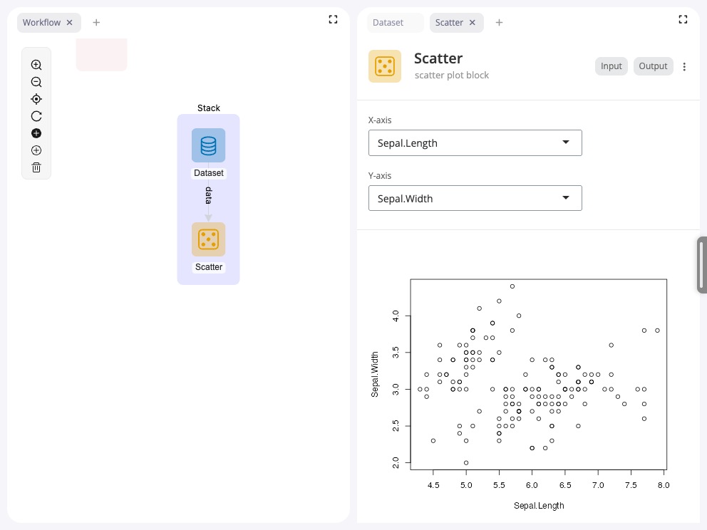

<!-- README.md is generated from README.Rmd. Please edit that file -->

# blockr.dag

<!-- badges: start -->

[](https://lifecycle.r-lib.org/articles/stages.html#experimental)
[](https://github.com/BristolMyersSquibb/blockr.dag/actions/workflows/ci.yaml)
[](https://app.codecov.io/gh/BristolMyersSquibb/blockr.dag)
[](https://CRAN.R-project.org/package=blockr.dag)
<!-- badges: end -->

An interative network library provided by g6R can be used as front-end
to a blockr board using this package.

## Installation

You can install the development version of blockr.dag from
[GitHub](https://github.com/) with:

``` r
# install.packages("pak")
pak::pak("BristolMyersSquibb/blockr.dag")
```

## Example

To start up a board with the `dag` extension, run the following code:

``` r
library(blockr.dag)
library(blockr.core)
library(blockr.dock)

options(
  "g6R.mode" = "dev",
  #"g6R.layout_on_data_change" = TRUE,
  "g6R.preserve_elements_position" = TRUE
)

serve(
  new_dock_board(
    blocks = c(
      a = new_dataset_block("iris"),
      b = new_scatter_block(x = "Sepal.Length", y = "Sepal.Width")
    ),
    links = list(from = "a", to = "b", input = "data"),
    stacks = c(
      stack_1 = new_dock_stack(c("a", "b"), color = "#0000FF"),
      stack_2 = new_dock_stack()
    ),
    extensions = new_dag_extension()
  )
)
```

<figure>

<figcaption aria-hidden="true">blockr.dag demo application with
stacks</figcaption>
</figure>

The board is the single source of truth for the DAG. The extension owns only
board-independent view attributes, e.g. node positions, passed as `positions`
(keyed by block id) and persisted across save / restore. The auto-layout
currently still computes final placement at cold start, so positions are not
yet honored over it (a planned follow-up):

``` r
library(blockr.dag)
library(blockr.dock)
library(blockr.core)

# The board is the single source of truth for nodes / edges / combos. The DAG
# extension only owns board-independent view attributes, e.g. node positions,
# supplied as a named list keyed by block id. Supplied positions pin those
# nodes over the auto-layout; the rest fall back to the layout.
positions <- list(
  a = list(x = 200, y = 150),
  b = list(x = 200, y = 350)
)

serve(
  new_dock_board(
    blocks = c(
      a = new_dataset_block("iris"),
      b = new_head_block()
    ),
    links = list(from = "a", to = "b", input = "data"),
    extensions = new_dag_extension(positions = positions)
  )
)
```
