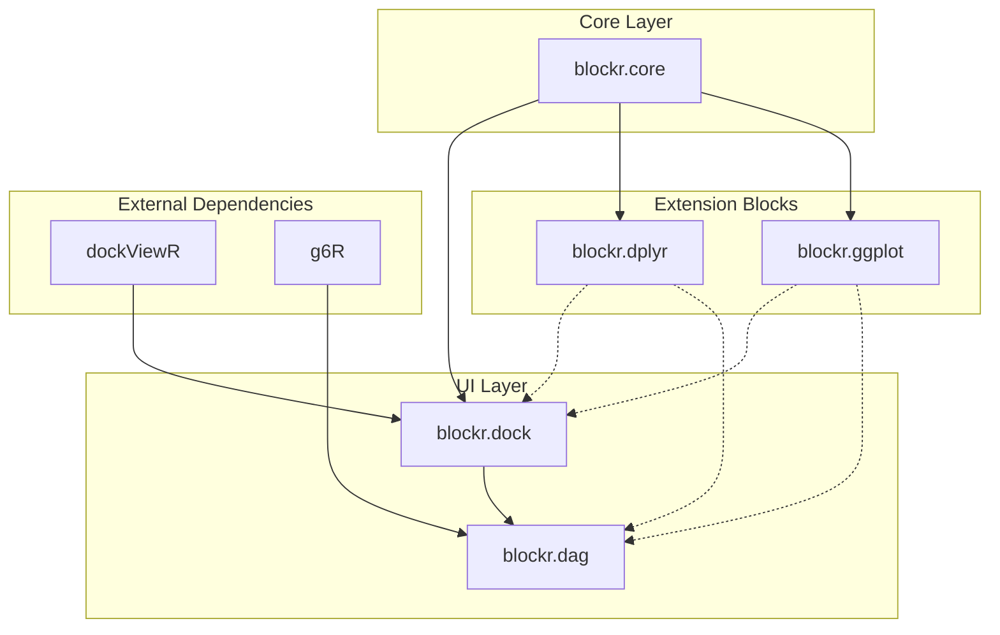

# blockr.dag

``` r

library(blockr.dag)
library(blockr.core)
library(blockr.dock)
```

## Basic Usage

### Starting a DAG Board

We create an empty board from
[blockr.dock](https://github.com/BristolMyersSquibb/blockr.dock) and
serve it with the
[`new_dag_extension()`](https://bristolmyerssquibb.github.io/blockr.dag/reference/dag.md)
extension:

``` r

# Create an empty board.
serve(new_dock_board(extensions = new_dag_extension()))
```

### Start from a graph object

You can also start with a custom graph structure:

``` r

graph <- new_graph(
  nodes = list(
    list(id = 1),
    list(id = 2)
  ),
  edges = list(
    list(
      source = 1,
      target = 2,
      style = list(labelText = "1-2")
    )
  )
)

serve(
  new_dock_board(
    extensions = new_dag_extension(graph)
  )
)
```

## Options

blockr.dag’s behaviour is tuned through a handful of R
[`options()`](https://rdrr.io/r/base/options.html), set before
[`serve()`](https://bristolmyerssquibb.github.io/blockr.core/reference/serve.html).
They split into options owned by blockr.dag and options it inherits from
[g6R](https://cynkra.github.io/g6R/), the engine that renders and drives
the DAG.

### blockr.dag options

| Option | Default | Description |
|----|----|----|
| `blockr.dag.svg_renderer` | `FALSE` | Render the DAG with g6R’s SVG renderer instead of the default canvas renderer. Canvas is the default because the SVG element reports `offsetWidth == 0`, which makes the underlying `g-lite` client/canvas coordinate scaling ignore the page zoom factor and desyncs hit-testing below 100% browser zoom (drops and port grabs silently fail). The SVG renderer keeps every element in the DOM, so it is mainly useful for `shinytest2` end-to-end tests, which opt in via `AppDriver$new(options = list(blockr.dag.svg_renderer = TRUE))`. |

### g6R options

Because blockr.dag renders through g6R, several g6R options shape DAG
behaviour. Set them alongside the board:

``` r

options(
  g6R.mode = "dev",
  g6R.directed_graph = TRUE,
  g6R.layout_on_data_change = TRUE
)

serve(new_dock_board(extensions = new_dag_extension()))
```

| Option | Default | Description |
|----|----|----|
| `g6R.mode` | `"prod"` | `"dev"` surfaces in-app notifications (e.g. why an edge drop was rejected); `"prod"` keeps them silent. Use `"dev"` while building. |
| `g6R.directed_graph` | `FALSE` | Maintain parent/child (tree) relationships as edges and nodes are added or removed through the g6R proxy. A DAG is directed, so this is typically `TRUE`; g6R also auto-enables it when nodes declare `children`. The tree bookkeeping is only kept in sync when you mutate the graph through the proxy functions, not the raw G6 JS API. |
| `g6R.layout_on_data_change` | `FALSE` | Re-run the layout whenever the graph data changes (a block or edge is added/removed), so the DAG re-arranges itself. With `FALSE`, existing nodes keep their position and only new elements are placed. |
| `g6R.preserve_elements_position` | `FALSE` | Preserve node positions across redraws instead of recomputing them. |

## User Interface Elements

### Keyboard Shortcuts

- **Shift + Drag**: Create connections between blocks.
- **Ctrl + Backspace**: Remove selected elements.
- **Alt/Option(Mac) + Drag**: Multi-select elements.

## Developer Guide

### Where does blockr.dag fit in?

In the blockr [ecosystem](https://bristolmyerssquibb.github.io/blockr/),
blockr.dag is a high level extension that usually comes at the end of
the stack. It depends on blockr.core for core functionalities and
blockr.dock for the user interface. It also relies on external packages
like g6R for rendering and interaction, as well as extra block packages
like blockr.dplyr and blockr.ggplot for additional block types:



### Maintaining the DAG state

Server-side observers handle state synchronization between the
block.core **board** and the g6R output. `update` and `board` are
inherited from `blockr.core`:

`update` is composed of:

| Category | Operation | Description                            |
|----------|-----------|----------------------------------------|
| `blocks` | `add`     | New blocks to add (blocks object)      |
|          | `mod`     | Modified blocks (blocks object)        |
|          | `rm`      | Deleted blocks (block IDS, character)  |
| `stacks` | `add`     | New stacks to add (stacks object)      |
|          | `mod`     | Modified stacks (stacks object)        |
|          | `rm`      | Deleted stacks (stacks IDS, character) |
| `links`  | `add`     | New links to add (links object)        |
|          | `mod`     | Modified links (links object)          |
|          | `rm`      | Deleted links (links IDS, character()) |

We listen to [`update()`](https://rdrr.io/r/stats/update.html) and apply
the necessary changes to the `g6R` widget via its **proxy** functions:

``` r

# Update observer handles board changes
update_observer <- function(update, board, proxy) {
  observeEvent(update(), {
    upd <- update()

    if (length(upd$blocks$add)) {
      add_nodes(upd$blocks$add, board$board, proxy)
    }

    if (length(upd$stacks$mod)) {
      update_combos(upd$stacks$mod, board$board, proxy)
    }

    # Handle other update types...
  })
}
```

## Extending the Package

### Custom context menu and toolbar

You can learn more in the following vignettes:

- [Context
  menu](https://bristolmyerssquibb.github.io/blockr.dag/articles/context-menu.html).
- [Toolbar](https://bristolmyerssquibb.github.io/blockr.dag/articles/toolbar.html).

### Extension block callback

blockr.dock exposes a callback system to extend block functionality. You
can learn more in the following
[vignette](https://bristolmyerssquibb.github.io/blockr.dag/articles/block-callback.html).
